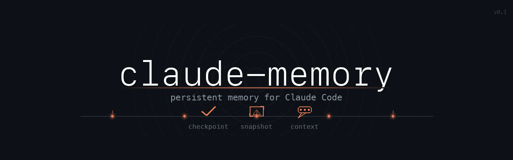

# Claude Memory



An MCP server that gives Claude Code persistent memory across terminal restarts, context-window compaction, and sessions — targeted access to relevant Claude Desktop / claude.ai conversations — and **bidirectional sync with claude.ai Projects**.

## Problems Solved

### 1. Terminal restart wipes everything

When your terminal closes — computer restart, crash, accidental close — Claude Code loses all context. You have to re-explain the project, current state, what decisions were made, and what was being worked on.

**Claude Memory fix:** Claude Code calls `save_session_checkpoint()` at natural stopping points. The next session calls `resume_session()` — a single call that returns both the latest checkpoint and all linked conversations, so work resumes instantly without re-explaining.

### 2. Context compaction loses screenshots

When a Claude Code session grows long enough to trigger compaction, earlier messages are summarised and image data is gone. Screenshots of bugs, UI states, and error dialogs become irretrievable.

**Claude Memory fix:** When an image is shared, Claude Code immediately calls `save_image()` to copy it to stable local storage and records a description. After compaction, `get_image(image_id)` returns the stored path; the `Read` tool re-embeds the image exactly as before.

### 3. Conversations contain richer context than documents

A planning conversation includes the full thought process — questions asked, alternatives rejected, trade-offs discussed, decisions and their rationale — not just the final output. Claude Code reading that conversation understands not just *what* to build but *why*.

### 4. Claude Desktop as your context hub

Configure all integrations (Confluence, Jira, Slack, browser extensions) in Claude Desktop, have conversations that use those tools, then have Claude Code read those conversations — keeping Claude Code lightweight while still accessing rich external context.

### 5. Bidirectional sync with claude.ai Projects

Research in claude.ai, implement in Claude Code, push progress back — all within the same Project. Claude Code pushes status summaries, TODOs, and session logs to your Project's knowledge base. Research done in claude.ai is readable from CLI. Multiple repos can map to one Project.

```
claude.ai Project
    ├── [manually added] Research notes, design docs
    ├── [cli] Status - repo-name.md     ← auto-pushed from CLI
    ├── [cli] TODOs - repo-name.md      ← pushed from CLI
    └── Project knowledge docs          ← readable from CLI

CLI (repos with <!-- claude-project: Name --> in CLAUDE.md)
    ├── reads Project knowledge docs
    └── pushes status/TODOs automatically
```

## Tools

### Session tools — local, no Chrome needed

| Tool | What it does |
|------|-------------|
| `resume_session` | **Single call at session start** — returns checkpoint + linked conversations |
| `save_session_checkpoint` | Save current session state to disk |
| `get_latest_session_checkpoint` | Retrieve the most recent checkpoint without resuming |
| `list_session_checkpoints` | Browse checkpoint history for a project |
| `list_all_projects` | List all projects that have stored data |
| `cleanup_session_checkpoints` | Delete old checkpoints, keeping only the N most recent |

### Image persistence — local, no Chrome needed

| Tool | What it does |
|------|-------------|
| `save_image` | Copy an image file to stable storage with a description |
| `get_image` | Retrieve stored image path and metadata after compaction |
| `list_images` | List saved images, optionally filtered by tag |
| `cleanup_images` | Delete images by age; remove orphaned metadata records |

### Project conversation registry — local, no Chrome needed

| Tool | What it does |
|------|-------------|
| `link_conversation` | Link a claude.ai conversation to a project — note auto-generated if omitted |
| `unlink_conversation` | Remove a link |
| `get_project_conversations` | Return conversations linked to this project with notes — zero API calls |

### Claude.ai conversation reading — requires Chrome login

| Tool | What it does |
|------|-------------|
| `list_conversations` | List recent conversations (use only to discover new ones to link) |
| `get_conversation` | Full conversation content — last resort only |
| `search_conversations` | Search conversation names/titles |
| `get_conversation_summary` | First/last messages — **cached to disk, no Chrome needed after first fetch** |

### claude.ai Project sync — requires Chrome login

| Tool | What it does |
|------|-------------|
| `list_projects` | List all claude.ai Projects in your organization |
| `list_project_docs` | List knowledge documents in a Project |
| `get_project_doc` | Read a specific Project knowledge document |
| `push_to_project` | Push arbitrary content as a Project knowledge doc |
| `push_session_summary` | Auto-generate and push status summary from git state |
| `push_todos` | Push a TODO list to a Project |

### Garbage collection — all default to `dry_run=True`

| Tool | What it does |
|------|-------------|
| `cleanup_session_checkpoints` | Keep only the N most recent checkpoints per project |
| `cleanup_images` | Delete old images by age; remove broken metadata references |
| `cleanup_summaries` | Delete cached summaries older than N days |

## Requirements

- Python 3.10+
- Chrome browser logged into claude.ai *(only for conversation-reading tools; all local storage tools work without Chrome)*

## Installation

1. Clone this repository:

```bash
git clone https://github.com/AmmarJawad/claude-memory.git
cd claude-memory
```

2. Install dependencies:

```bash
pip install -r requirements.txt
```

3. Add to your Claude Code MCP settings (`~/.claude.json`):

```json
{
  "mcpServers": {
    "claude-memory": {
      "type": "stdio",
      "command": "python3",
      "args": ["/path/to/claude-memory/server.py"]
    }
  }
}
```

### For Claude Desktop

Add to `~/Library/Application Support/Claude/claude_desktop_config.json` on macOS:

```json
{
  "mcpServers": {
    "claude-memory": {
      "command": "python3",
      "args": ["/path/to/claude-memory/server.py"]
    }
  }
}
```

## Avoiding context bloat

Use `resume_session` at the start of every session — one call, no API, returns everything needed to continue:

```python
resume_session("/path/to/project")
# → {
#     "checkpoint": { "summary": "...", "current_task": "...", ... },
#     "linked_conversations": [{ "conversation_id": "abc-123", "note": "auth design — JWT..." }]
#   }
```

From the notes alone you can usually decide what, if anything, to fetch. If a note is insufficient:

```python
get_conversation_summary("abc-123")  # cached after first fetch — no Chrome needed
get_conversation("abc-123")          # full content — last resort only
```

When linking a conversation, the note is auto-generated from the conversation's name and first message if you don't provide one:

```python
link_conversation("/path/to/project", "abc-123")
# auto-note: "Auth Design Session: How should we handle token refresh? ..."
```

Never call `list_conversations` to browse for relevant conversations — use `get_project_conversations` instead. Only call `list_conversations` when explicitly looking for a new conversation to link.

## Configuring Claude Code to use these features automatically

Add the following to your project's `CLAUDE.md` (or your global `~/.claude/CLAUDE.md`). This instructs Claude Code to use all features automatically without being asked.

```markdown
## Session continuity (via claude-memory MCP)

**At the start of every session:**
Call `resume_session` with the project path. It returns both the latest
checkpoint and all linked conversations in a single call. Read the checkpoint
to restore context. Read the conversation notes — fetch a conversation only
if the note indicates the content is needed right now.

Fetch order (leanest to most expensive):
- Note alone — skip fetch if it answers your question
- `get_conversation_summary(id)` — cached, no Chrome required after first fetch
- `get_conversation(id)` — full content, last resort only

**During the session:**
Call `save_session_checkpoint` whenever a significant milestone is reached.
If a claude.ai conversation proves useful, call `link_conversation` with just
the conversation ID — the note is auto-generated.

**Before stopping work:**
Always call `save_session_checkpoint` with:
- `summary`: what was accomplished (specific files, features, fixes)
- `current_task`: anything in-progress or interrupted mid-task
- `key_files`: comma-separated paths of files created or modified
- `decisions_made`: architectural or design choices and their rationale
- `open_questions`: blockers or things to investigate next

Never call `list_conversations` to browse — use `resume_session` or
`get_project_conversations` instead. Only call `list_conversations` when
explicitly asked to discover a new conversation to link.

## Image / screenshot continuity (via claude-memory MCP)

**When any image or screenshot is shared:**
Immediately call `save_image` with:
- `source_path`: the file path (if the image came from a file)
- `description`: detailed description of everything visible — UI elements,
  error text, file paths, layout. This survives even if the file is lost.
- `tags`: relevant tags (e.g. "screenshot,bug,login-page")

Note the returned `image_id` and `stored_path`.

**After context compaction (if an image is no longer visible):**
Call `get_image(image_id)` to retrieve the stored path, then use the Read
tool on `stored_path` to re-embed the image.

## claude.ai Project sync (via claude-memory MCP)

**Setup:** Add `<!-- claude-project: Project Name -->` to this project's
CLAUDE.md to map it to a claude.ai Project.

**Push progress automatically:**
After significant milestones, call `push_session_summary` to push a
git-derived status summary to the Project. Use `push_todos` to share
the TODO list. Use `push_to_project` for custom content (design notes,
decisions, research summaries).

**Read Project knowledge:**
Call `list_project_docs` to see what's in the Project (including docs
added manually in claude.ai). Call `get_project_doc` to read specific
documents. This enables research done in claude.ai to flow back into CLI.
```

## Bidirectional Project sync

### Setup

Add a project mapping tag to your repository's `CLAUDE.md`:

```markdown
<!-- claude-project: My Project Name -->
```

This maps the repo to the claude.ai Project with that name. Multiple repos can map to the same Project.

### Pushing from CLI

```python
# Push arbitrary content
push_to_project(content="# Design Notes\n\nWe chose approach B because...", doc_name="design-notes.md")

# Auto-generate and push status from git state
push_session_summary()
# → creates "[cli] Status - repo-name.md" with recent commits, branch, ahead count

# Push a TODO list
push_todos(todos=["[x] Implement auth", "Write tests", "Update docs"])
# → creates "[cli] TODOs - repo-name.md"
```

### Reading from CLI

```python
# List all Projects
list_projects()

# Browse Project knowledge docs
list_project_docs()  # uses project from CLAUDE.md
list_project_docs(project="My Project Name")  # or specify explicitly

# Read a specific doc
get_project_doc(doc_id="abc-123")
```

### Automation

Use the included hook script for auto-push on git events:

```bash
# hooks/post_push.sh — runs: python -m context_bridge.push --auto
# Configure as a Claude Code PostToolUse hook or git post-commit hook
```

The auto-push respects a 2-minute cooldown to avoid API spam.

## Storage

All local data is stored in `~/.claude-memory/` — nothing is sent to any external service.

```
~/.claude-memory/
├── sessions/    one JSON file per checkpoint, keyed by project path
├── images/      copied image files + JSON metadata, keyed by image ID
├── projects/    conversation registry, one JSON file per project
└── summaries/   cached conversation summaries, keyed by conversation ID
```

### Garbage collection

All cleanup tools default to `dry_run=True` — preview before deleting.

```python
# Preview
cleanup_session_checkpoints("/path/to/project", keep_latest=10)
cleanup_images(older_than_days=30)
cleanup_summaries(older_than_days=90)

# Delete for real
cleanup_session_checkpoints("/path/to/project", keep_latest=10, dry_run=False)
cleanup_images(older_than_days=30, dry_run=False)
cleanup_summaries(older_than_days=90, dry_run=False)
```

## How conversation reading works

The server reads Chrome's cookies to authenticate with the claude.ai API — no API key required:

1. Log into claude.ai in Chrome
2. Conversations from both Claude Desktop and claude.ai web are accessible
3. `get_conversation_summary` caches its result on first fetch; subsequent calls need no Chrome session

## Running tests

```bash
# Local storage tools (sessions, images, registries)
pytest test_server.py -v

# Project sync tools (context_bridge package)
pytest tests/ -v

# All tests
pytest test_server.py tests/ -v
```

`test_server.py` covers all local storage tools. `tests/` covers the Project sync package (auth, config, projects API, content generation). Claude.ai API tools require a live Chrome session and are not unit-tested.

## Limitations

- **Chrome only** for conversation and Project tools — Safari and Firefox are not supported
- **Conversations are read-only** — conversations cannot be written to or modified (Project knowledge docs can be written)
- **File-based images** — `save_image` with no `source_path` stores a description only; clipboard-pasted images with no file path cannot be saved as files
- **Session expiry** — re-login to Chrome when your claude.ai session expires

## License

MIT
